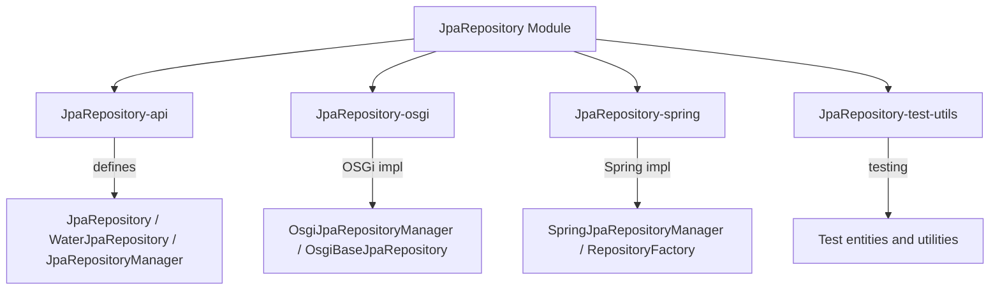

# JpaRepository Module

## Module Goal
The JpaRepository module provides a unified, cross-platform abstraction for JPA-based persistence in the Water Framework. It enables Water applications to use JPA repositories in a technology-agnostic way, supporting both OSGi and Spring environments, and offering advanced features such as transaction management, entity expansion, and dynamic repository instantiation.

## Architecture Overview



## Sub-modules

| Sub-module | Description |
|---|---|
| **JpaRepository-api** | Core interfaces: `JpaRepository<T>`, `WaterJpaRepository<T>`, `JpaRepositoryManager`, `AbstractJpaEntity` |
| **JpaRepository-osgi** | OSGi implementation: `OsgiJpaRepositoryManager`, `OsgiBaseJpaRepository` |
| **JpaRepository-spring** | Spring implementation: `SpringJpaRepositoryManager`, `RepositoryFactory`, `JpaRepositoryImpl` |
| **JpaRepository-test-utils** | Test utilities for repository and transaction testing |

## Module Technical Characteristics

### Core Technologies
- **JPA (Jakarta Persistence API):** Standard Java persistence for ORM and database access.
- **Water Core Modules:** Integrates with Water's core, model, registry, and service abstractions.
- **OSGi and Spring:** Provides concrete repository implementations for both OSGi and Spring runtimes.
- **Lombok:** Reduces boilerplate code.
- **JUnit 5:** For testing, including test utilities for repository operations.

### Architecture Components
- **API Layer (`JpaRepository-api`)**
  - `JpaRepository<T>`: Extends Water's `BaseRepository` with JPA-specific methods (e.g., direct `EntityManager` access, transaction helpers).
  - `WaterJpaRepository<T>`: Marker interface for framework repositories, to be instantiated per technology (OSGi, Spring, etc.).
  - `JpaRepositoryManager`: Factory for creating technology-specific repository instances.
  - `AbstractJpaEntity`: Base class for JPA entities, with auditing and expansion support.
- **OSGi Implementation (`JpaRepository-osgi`)**
  - `OsgiJpaRepositoryManager`: Creates OSGi-based repository implementations.
  - `OsgiBaseJpaRepository`: OSGi-specific repository logic.
- **Spring Implementation (`JpaRepository-spring`)**
  - `SpringJpaRepositoryManager`: Creates Spring-based repository implementations.
  - `SpringBaseJpaRepositoryImpl`, `JpaRepositoryImpl`: Spring-specific repository logic.
  - `RepositoryFactory`: Factory for dynamic repository instantiation in Spring.
- **Test Utilities (`JpaRepository-test-utils`)**
  - Utilities and test entities for verifying repository behavior and transaction management.

### Key Features
- Unified repository API for both OSGi and Spring
- Dynamic repository instantiation via `JpaRepositoryManager`
- Direct access to JPA `EntityManager` and transaction helpers
- Base entity with auditing and expansion support
- Test utilities for repository and transaction testing

## Permission and Security
- **Repository Security:** The module itself does not enforce permissions, but integrates with Water's core security and validation mechanisms.
- **Entity Validation:** Entities are validated via Water's validation system before persistence.
- **Transaction Management:** All repository operations can be executed within managed transactions, ensuring data integrity.
- **Component Registration:** Only authorized components can register repositories at runtime (enforced by Water core).

## How to Use It

### 1. Module Import
Add the JpaRepository module and the desired submodule (OSGi or Spring) to your project dependencies:

```gradle
// For OSGi
implementation 'it.water.repository.jpa:JpaRepository-osgi:${waterVersion}'

// For Spring
implementation 'it.water.repository.jpa:JpaRepository-spring:${waterVersion}'
```

### 2. Define Your Entity
```java
@Entity
public class MyEntity extends AbstractJpaEntity {
    // Your fields and methods
}
```

### 3. Obtain a Repository
```java
// Inject JpaRepositoryManager
@Inject
private JpaRepositoryManager jpaRepositoryManager;

// Create a repository for your entity
JpaRepository<MyEntity> repo = jpaRepositoryManager.createConcreteRepository(MyEntity.class, "my-persistence-unit");
```

### 4. Use Repository Methods
```java
// Save an entity
repo.save(myEntity);

// Find by ID
MyEntity found = repo.find(1L);

// Use transaction helpers
repo.txExpr(Transactional.TxType.REQUIRED, em -> {
    // Use the EntityManager directly
    em.persist(new MyEntity());
});
```

### 5. Test Utilities
- Use `JpaRepository-test-utils` for integration testing of repositories and transactions.
- Example from tests:
```java
Assertions.assertDoesNotThrow(() -> sampleRepo.txExpr(Transactional.TxType.REQUIRED, entityManager -> System.out.println("sample transaction")));
```

## Properties and Configurations

### Common Properties
- **Persistence Unit Name:** Specify the JPA persistence unit when creating repositories (e.g., `"water-default-persistence-unit"`).
- **JPA Properties:** Configure via standard JPA mechanisms (e.g., `persistence.xml`, Spring Boot properties).
- **Water Core Properties:** All Water core configuration is supported.

### Test Properties (from test classes)
- Test utilities use the default persistence unit: `water-default-persistence-unit`.
- No additional properties are required for basic tests.

## How to Customize Behaviours for This Module

### 1. Custom Repository Implementation
Extend `BaseJpaRepositoryImpl` or the technology-specific base class to add custom repository logic:
```java
public class MyCustomRepository<T extends BaseEntity> extends BaseJpaRepositoryImpl<T> {
    // Custom methods and overrides
}
```

### 2. Custom JpaRepositoryManager
Implement your own `JpaRepositoryManager` to control how repositories are instantiated:
```java
@FrameworkComponent(services = JpaRepositoryManager.class, priority = 2)
public class CustomJpaRepositoryManager implements JpaRepositoryManager {
    @Override
    public <T extends BaseEntity> JpaRepository<T> createConcreteRepository(Class<T> entityType, String persistenceUnit) {
        // Custom instantiation logic
    }
}
```

### 3. Entity Expansion
Extend `AbstractJpaEntityExpansion` or `AbstractJpaExpandableEntity` to support dynamic entity fields or behaviors.

### 4. Transaction Customization
Override transaction helpers or use custom transaction management strategies as needed.

### 5. Test Utilities
Use or extend the provided test utilities for custom test scenarios or entity types.

---

The JpaRepository module provides a robust, extensible, and cross-platform foundation for JPA persistence in Water Framework applications, supporting both OSGi and Spring environments with advanced features and customization options.

